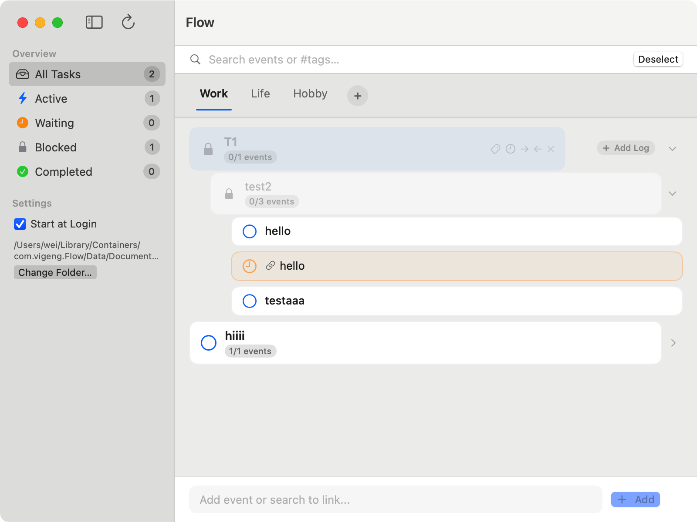

# Flow

A native macOS task manager built with SwiftUI. Tasks are stored as a **recursive tree** in a single Markdown file — compatible with iCloud, Obsidian, and any text editor.



Key philosophy:
- This app serves as a task/event flow friendly viewer/editor for markdown file. so this app is regarded as an flow-augmented markdown editor and viewer.
- It also serves as a work log that streamlines what is happening along side the task/event flow.

## Why Flow?

Traditional todo apps hide your data in proprietary formats. Flow stores everything in plain Markdown:

```markdown
- [ ] Launch Product
    - [x] Design landing page
    - [ ] Setup CI/CD pipeline
    - [ ] Wait for domain transfer #wait
    - [ ] Deploy to production
```

**The key insight:** tasks have *dependencies*. When a child is waiting, the parent is automatically blocked. When the blocker resolves, everything upstream unlocks — like a flow.

## Features

- **Recursive task tree** with unlimited nesting
- **State propagation** — parent states auto-compute from children
- **`#wait` tags** — mark blockers, see them propagate up
- **Plain Markdown storage** — edit in Flow, Obsidian, or vim
- **iCloud sync** — via the shared Markdown file
- **Drag & drop** reordering
- **Inline editing** — double-click any task
- **Search & filter** by state, tags, or text
- **Reference system** — link tasks across branches
- **Accordion mode** — focus on one root task at a time

## Install

### Homebrew

### Homebrew

```bash
brew tap ViGeng/tap
brew install --cask flow
```

> [!TIP]
> If you encounter a naming conflict with the standard `flow` formula or `flow-desktop` cask, use the fully qualified name:
>
> ```bash
> brew install --cask vigeng/tap/flow
> brew upgrade vigeng/tap/flow
> ```

### Manual

Download the latest `.dmg` from [Releases](https://github.com/ViGeng/flow/releases).

## Build from Source

```bash
git clone git@github.com:ViGeng/flow.git
cd flow
xcodebuild build -project Flow.xcodeproj -scheme Flow -destination 'platform=macOS'
```

Requires Xcode 15+ and macOS 14+.

## Architecture

```
Flow/
├── FlowApp.swift           # @main entry point
├── FlowViewModel.swift     # ViewModel (tree ops, file I/O)
├── ContentView.swift       # Layout (sidebar + tree)
├── EventCardView.swift     # Recursive task row
├── ComposerView.swift      # Bottom input bar
├── MarkdownParser.swift    # Markdown ↔ tree parser
└── TaskItem.swift          # EventNode model
```

Data file: `flow.md` (stored in user-chosen directory, iCloud, or `~/Documents/Flow/`).

## License

This project is licensed under the [Creative Commons Attribution-NonCommercial 4.0 International (CC BY-NC 4.0)](https://creativecommons.org/licenses/by-nc/4.0/) License.

- **Personal Use**: Free
- **Commercial/Business Use**: Prohibited